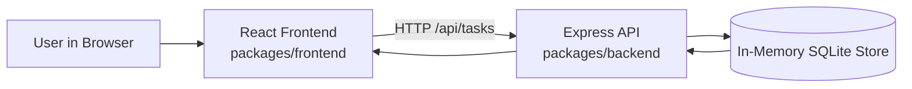
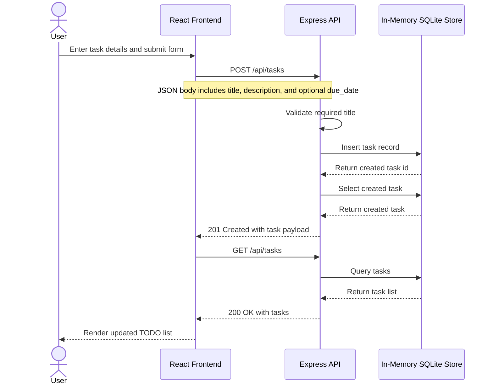

# Cloud Architecture Overview

This monorepo contains a browser-based React frontend and an Express API running as a single local application stack. The API persists task data in an in-memory SQLite store, so data exists only for the life of the running backend process.

## Create TODO Sequence

## Notes

- The frontend is a React application served from the `packages/frontend` workspace.
- The backend is an Express application in `packages/backend`.
- Task data is stored in-process using an in-memory SQLite database.
- Because the store is in-memory, task data is reset when the backend restarts.